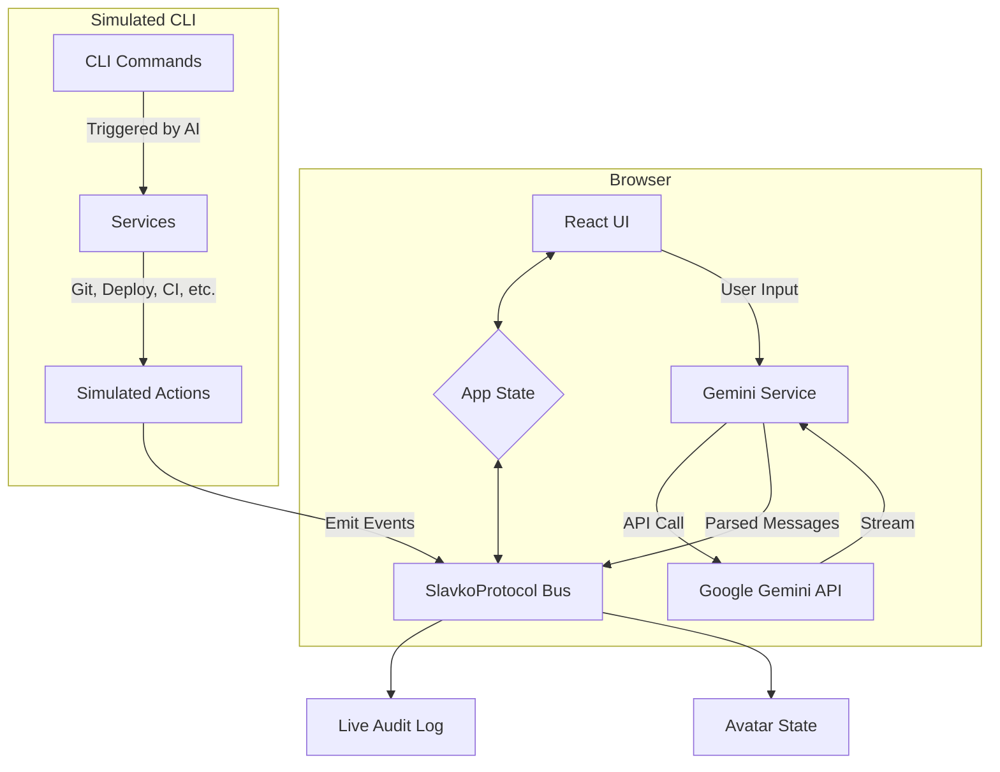

# 🚀 SlavkoShell: One-CLI Deploy

[](https://vercel.com/new/clone?repository-url=https%3A%2F%2Fgithub.com%2Fslavko-kernel%2Fone-cli-deploy)

**SlavkoShell** je interaktivna web aplikacija koja simulira moćan **"one-click" CLI deployment alat**, inspiriran **SlavkoKernel Bootstrap** filozofijom. Automatizira cijeli životni ciklus modernog **Next.js** projekta – od **analize skripte**, preko **generiranja dokumentacije**, do **simuliranog produkcijskog deploya** na više platformi (Vercel, Netlify, AWS, Azure, Docker) uz **AI-pokretane uvide**.

[](https://reactjs.org/)
[](https://www.typescriptlang.org/)
[](https://ai.google.dev/)
[](https://opensource.org/licenses/MIT)
[](CHANGELOG.md)

---

## ⚡ Quick Start

1.  **Otvorite aplikaciju** u vašem pregledniku.
2.  **Odaberite API ključ**: Aplikacija će vas zatražiti da odaberete Google Gemini API ključ.
3.  **Koristite Quick Actions**: Kliknite na "New Project" gumb da popunite naredbu.
4.  **Postavite varijable**: Unesite potrebne `Environment Variables` (npr. `VERCEL_TOKEN`).
5.  **Konfigurirajte deploy**: U panelu `Deployment Configuration` postavite željenog providera ili ostavite `"auto"`.
6.  **Pitajte AI**: Izvršite naredbu i koristite chat za daljnju analizu.
7.  **Pratite uživo**: Gledajte kako se naredbe izvršavaju u **SlavkoProtocol™ Live Audit** logu.

---

### 📦  Visual “Getting Started”

---

#### 1️⃣  Launch the app in your browser

```bash
npm run dev
```

> **Screenshot** – The landing page with the hero section.  
> 

---

#### 2️⃣  Pick an API key (Google Gemini)

The first time you run the app you’ll be prompted to **select a Gemini API key**.

> **Modal** – A sleek, dark‑mode modal that asks you to plug in your key.  
> 

---

#### 3️⃣  Create a new project (or import an existing GitHub repo)

Click **“New Project”** and choose a project template or enter your GitHub URL.

> **Form & toast** – A clean, responsive form that validates the URL.  
> 

---

#### 4️⃣  Configure your deployment

Under the **Deployment Configuration** panel you can:
1. Edit the JSON to set `provider: "auto"` or pick a specific one.
2. Add environment variables.

> **Panel** – The JSON editor shows syntax highlighting (PrismJS).  
> 

---

#### 5️⃣  Run a command in the chat

Use the **Chat panel** to type a command, e.g.

```
deploy
```

The AI will parse it, trigger the appropriate provider, and stream back status messages.

> **Chat demo** – Animated log lines appear in real time; typing indicators show when Gemini is generating.  
> 

---

#### 6️⃣  Inspect the live audit log

Below the chat you’ll find the **SlavkoProtocol™ Live Audit** log.  
It scrolls automatically and shows every stage of the deployment, including failures.

> **Log window** – Monospace style, syntax‑colored JSON, with a download button for full history.  
> 

---

> **Bonus** – Add a *“Download Log”* screenshot to demonstrate the export feature.

---

## 📌  Quick‑link to the screenshots

| Step | Screenshot |
|------|------------|
| 1️⃣  Launch app  |  |
| 2️⃣  API key modal  |  |
| 3️⃣  New project wizard  |  |
| 4️⃣  Deploy config panel  |  |
| 5️⃣  Chat demo  |  |
| 6️⃣  Audit log  |  |

---

### 🎁  What to do next

1. **Add the images** to your repo (`docs/assets/screenshots/…`).  
2. **Run `npm run build`** and open `dist/index.html` to double‑check all paths resolve.  
3. Commit the image files – GitHub‑Pages, Netlify, or Vercel will serve them along with the README.

---

## 🎯 Značajke

| Feature                                       | Status |
|-----------------------------------------------|:------:|
| ✅ **Multi-Provider Deploy Router**           | ✅ |
| ✅ **Custom Project Templates**               | ✅ |
| ✅ AI-pokretana analiza skripte (Gemini)      | ✅ |
| ✅ Automatsko generiranje dokumentacije       | ✅ |
| ✅ Interaktivni "dark cockpit" UI             | ✅ |
| ✅ Text-to-Speech (TTS) za odgovore           | ✅ |
| ✅ Simulacija CI/CD i Git operacija           | ✅ |
| ✅ "Quick Actions" za brze naredbe            | ✅ |

---

## 🏗️ Arhitektura

SlavkoShell je **klijentska React aplikacija** koja komunicira s **Google Gemini API-jem**. Ona simulira puno CLI iskustvo unutar preglednika.


*Više detalja u [docs/ARCHITECTURE.md](docs/ARCHITECTURE.md).*

---

## 🔧 Korištenje naprednih naredbi

### `slavko new` s predlošcima

Koristite `--template` opciju za odabir predloška projekta.

```bash
# Kreiranje Next.js projekta (default)
slavko new my-next-app --github-repo user/repo

# Kreiranje jednostavnog HTML projekta
slavko new my-html-site --github-repo user/repo --template basic-html
```

### `slavko deploy` s auto-detekcijom

Ako je `provider` postavljen na `auto`, aplikacija će pokušati detektirati platformu iz imena projekta.

```bash
# Pokušat će deployati na Netlify
slavko deploy --name my-app-netlify
```

---

## 🚀 Self‑Deployment

SlavkoShell can trigger its own deployment pipeline from **inside the UI** or **automatically** on GitHub triggers.

### 1️⃣  Manual “Redeploy Yourself”

Click the **Redeploy Yourself** button on the **Project Dashboard**.  
It will dispatch the workflow you configured in `deploy.yml` (or the first workflow that contains that file).

### 2️⃣  Auto‑Deploy on Push

Add the following webhook to the same repo that hosts this application:

```
URL:          https://YOUR-APP.com/api/webhooks/github
Content‑type: application/json
Events:       push
```

With the `GH_TOKEN` (scopes: `repo`, `workflow`) set as a secret, every push to `main` (or `ref` you chose) will fire the same deployment.

> **Tip** – Use a dedicated workflow that runs the `deploy` command; commit changes to `deploy.yml` and restart the app when you need a new deployment trigger.

---

##  Shell Completion

To enable shell completion for `slavko` commands, you can generate a script for your shell.

Run the following command:

```bash
slavko completion [your-shell]
```
Replace `[your-shell]` with `bash`, `zsh`, or `fish`. The command will output instructions on how to add the completion script to your shell's profile. You will then need to restart your shell or source your profile file.

---
## 🔐 Sigurnost

-   **API ključevi** se upravljaju isključivo kroz sigurno AI Studio okruženje i nikada se ne pohranjuju u `localStorage`.
-   **Varijable okruženja** (poput `VERCEL_TOKEN`) pohranjuju se u `localStorage`, što je standardna praksa, ali osjetljivo na XSS napade. Aplikacija koristi osnovne mjere sanitizacije.
-   Sva komunikacija s Gemini API-jem odvija se preko **HTTPS-a**.

*Više detalja u [docs/SECURITY.md](docs/SECURITY.md).*

---
## 🐞 Rješavanje problema

| Problem | Rješenje |
|---------|----------|
| **"API key not valid"** | Odaberite ispravan Gemini API ključ i provjerite je li billing omogućen za vaš Google Cloud projekt. |
| **TTS ne radi** | Provjerite API ključ i dopuštenja preglednika za reprodukciju zvuka. |
| **Skripta se ne učitava s GitHuba** | Provjerite je li URL ispravan (link na raw datoteku) i da nema CORS problema. |

*Više detalja u [docs/TROUBLESHOOTING.md](docs/TROUBLESHOOTING.md).*

---
**Made with ❤️ by Mladen **